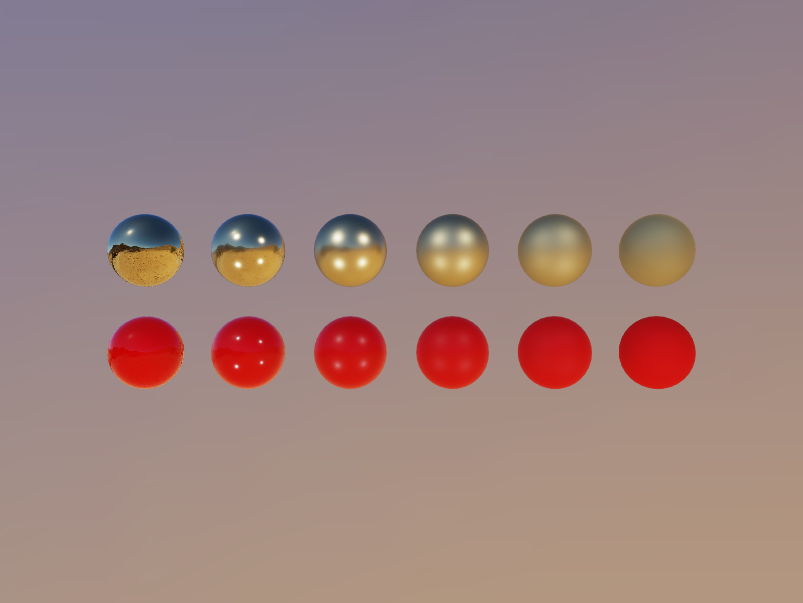

# PBR in WebGPU



See [Live demo](https://tchayen.com/webgpu-pbr).

This is example of a PBR (_Physically Based Rendering_) with IBL (_Image Based Lighting_) written in WebGPU. At the moment of writing this I couldn't find any learning materials explaining how to do this so I made it with a lot of trial and error, exploring how to map WebGL concept and APIs to WebGPU.

I hope it will be useful to you!

## How to run

1. Install dependencies (works interchangeably with `pnpm` and `yarn` if you prefer).

   ```
   npm install
   ```

2. Run development server.

   ```
   npm run vite dev
   ```

3. Open [http://localhost:5173](http://localhost:5173) in your browser.

## Sources

- [Learn OpenGL](https://learnopengl.com)
- [Filament](https://google.github.io/filament/Filament.html)
- [Real Shading in Unreal Engine 4](https://blog.selfshadow.com/publications/s2013-shading-course/karis/s2013_pbs_epic_notes_v2.pdf)
